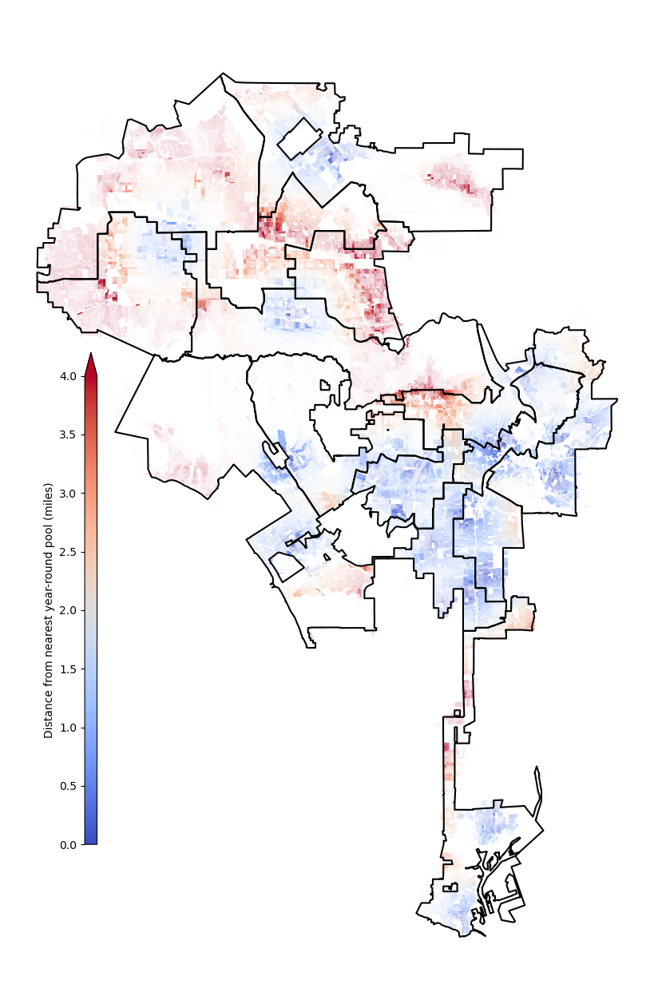
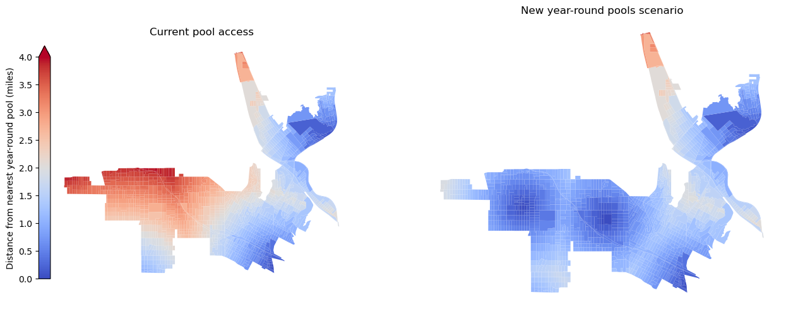

# Pool access in Los Angeles' 13th council district

Access to public swimming facilities provides people with numerous
[health](https://www.cdc.gov/healthywater/swimming/swimmers/health_benefits_water_exercise.html)
and [community](https://www.kcrw.com/culture/shows/design-and-architecture/public-swimming-pools-and-the-mindscape-of-los-angeles-1) benefits.
However, such access in Los Angeles is extremely unevenly distributed,
leaving many communities without good opportunities for exercise and recreation.

## Headlines

* Los Angeles' 13th city council district, represented by Hugo Soto-Martinez, which includes the neighborhoods of Hollywood, East Hollywood, Silver Lake, and Echo Park, has the fewest public swimming pools of any council district in the city. There are no year round pools, and only one seasonal pool (seasonal pools are only open for the summer months).
* 54% of the residents of council district 13 live further than two miles from their nearest year-round public pool (mostly driven by poor access in Hollywood and East Hollywood). This is the highest percentage of any council district outside of the San Fernando Valley. The San Fernando Valley as a whole has poor access to year-round pools.
* If we were to open the Hollywood pool year-round, then the percentage of council district 13 residents further than two miles from a year-round public pool would decrease from 54% to 10%. If we were to additionally convince LA City College in East Hollywood to open its pool to community members, then almost no residents of CD 13 would be further than two miles from a year-round public pool.
* The highest-impact pools to open year-round in Los Angeles (ordered by the number of residents who would gain new access to public pools) are:
    1. Los Angeles City College Pool (East Hollywood, 189,000 people)
    1. Sepulveda Pool (Panorama City, 182,000 people)
    1. Hollywood Pool (Hollywood, 178,000 people)
    1. Valley Plaza Pool (North Hollywood, 150,000 people)
    1. North Hollywood Pool (North Hollywood, 142,000 people)
  
    All together, if these pools were open year-round to the community, there would be 668,000 new LA residents with new access to public pools (as defined by living under two miles away).
    
## Supporting maps and tables

Current year-round pool access by council district:

<table id="T_0e7c9">
  <thead>
    <tr>
      <th id="T_0e7c9_level0_col0" class="col_heading level0 col0" >Council District</th>
      <th id="T_0e7c9_level0_col1" class="col_heading level0 col1" >Councilmember</th>
      <th id="T_0e7c9_level0_col2" class="col_heading level0 col2" >Population under two miles from a year-round pool</th>
      <th id="T_0e7c9_level0_col3" class="col_heading level0 col3" >Year-round pools</th>
      <th id="T_0e7c9_level0_col4" class="col_heading level0 col4" >Pools</th>
    </tr>
  </thead>
  <tbody>
    <tr>
      <td id="T_0e7c9_row0_col0" class="data row0 col0" >6</td>
      <td id="T_0e7c9_row0_col1" class="data row0 col1" >Vacant</td>
      <td id="T_0e7c9_row0_col2" class="data row0 col2" >8%</td>
      <td id="T_0e7c9_row0_col3" class="data row0 col3" >0</td>
      <td id="T_0e7c9_row0_col4" class="data row0 col4" >3</td>
    </tr>
    <tr>
      <td id="T_0e7c9_row1_col0" class="data row1 col0" >2</td>
      <td id="T_0e7c9_row1_col1" class="data row1 col1" >Paul Krekorian</td>
      <td id="T_0e7c9_row1_col2" class="data row1 col2" >9%</td>
      <td id="T_0e7c9_row1_col3" class="data row1 col3" >0</td>
      <td id="T_0e7c9_row1_col4" class="data row1 col4" >2</td>
    </tr>
    <tr>
      <td id="T_0e7c9_row2_col0" class="data row2 col0" >12</td>
      <td id="T_0e7c9_row2_col1" class="data row2 col1" >John Lee</td>
      <td id="T_0e7c9_row2_col2" class="data row2 col2" >15%</td>
      <td id="T_0e7c9_row2_col3" class="data row2 col3" >0</td>
      <td id="T_0e7c9_row2_col4" class="data row2 col4" >2</td>
    </tr>
    <tr>
      <td id="T_0e7c9_row3_col0" class="data row3 col0" >3</td>
      <td id="T_0e7c9_row3_col1" class="data row3 col1" >Bob Blumenfield</td>
      <td id="T_0e7c9_row3_col2" class="data row3 col2" >28%</td>
      <td id="T_0e7c9_row3_col3" class="data row3 col3" >0</td>
      <td id="T_0e7c9_row3_col4" class="data row3 col4" >3</td>
    </tr>
    <tr>
      <td id="T_0e7c9_row4_col0" class="data row4 col0" >13</td>
      <td id="T_0e7c9_row4_col1" class="data row4 col1" >Hugo Soto-Martinez</td>
      <td id="T_0e7c9_row4_col2" class="data row4 col2" >42%</td>
      <td id="T_0e7c9_row4_col3" class="data row4 col3" >0</td>
      <td id="T_0e7c9_row4_col4" class="data row4 col4" >1</td>
    </tr>
    <tr>
      <td id="T_0e7c9_row5_col0" class="data row5 col0" >4</td>
      <td id="T_0e7c9_row5_col1" class="data row5 col1" >Nithya Raman</td>
      <td id="T_0e7c9_row5_col2" class="data row5 col2" >44%</td>
      <td id="T_0e7c9_row5_col3" class="data row5 col3" >2</td>
      <td id="T_0e7c9_row5_col4" class="data row5 col4" >2</td>
    </tr>
    <tr>
      <td id="T_0e7c9_row6_col0" class="data row6 col0" >15</td>
      <td id="T_0e7c9_row6_col1" class="data row6 col1" >Tim McOsker</td>
      <td id="T_0e7c9_row6_col2" class="data row6 col2" >46%</td>
      <td id="T_0e7c9_row6_col3" class="data row6 col3" >2</td>
      <td id="T_0e7c9_row6_col4" class="data row6 col4" >4</td>
    </tr>
    <tr>
      <td id="T_0e7c9_row7_col0" class="data row7 col0" >7</td>
      <td id="T_0e7c9_row7_col1" class="data row7 col1" >Monica Rodriguez</td>
      <td id="T_0e7c9_row7_col2" class="data row7 col2" >51%</td>
      <td id="T_0e7c9_row7_col3" class="data row7 col3" >2</td>
      <td id="T_0e7c9_row7_col4" class="data row7 col4" >4</td>
    </tr>
    <tr>
      <td id="T_0e7c9_row8_col0" class="data row8 col0" >11</td>
      <td id="T_0e7c9_row8_col1" class="data row8 col1" >Traci Park</td>
      <td id="T_0e7c9_row8_col2" class="data row8 col2" >63%</td>
      <td id="T_0e7c9_row8_col3" class="data row8 col3" >1</td>
      <td id="T_0e7c9_row8_col4" class="data row8 col4" >5</td>
    </tr>
    <tr>
      <td id="T_0e7c9_row9_col0" class="data row9 col0" >5</td>
      <td id="T_0e7c9_row9_col1" class="data row9 col1" >Katy Yaroslavsky</td>
      <td id="T_0e7c9_row9_col2" class="data row9 col2" >69%</td>
      <td id="T_0e7c9_row9_col3" class="data row9 col3" >1</td>
      <td id="T_0e7c9_row9_col4" class="data row9 col4" >4</td>
    </tr>
    <tr>
      <td id="T_0e7c9_row10_col0" class="data row10 col0" >10</td>
      <td id="T_0e7c9_row10_col1" class="data row10 col1" >Heather Hutt</td>
      <td id="T_0e7c9_row10_col2" class="data row10 col2" >82%</td>
      <td id="T_0e7c9_row10_col3" class="data row10 col3" >3</td>
      <td id="T_0e7c9_row10_col4" class="data row10 col4" >3</td>
    </tr>
    <tr>
      <td id="T_0e7c9_row11_col0" class="data row11 col0" >14</td>
      <td id="T_0e7c9_row11_col1" class="data row11 col1" >Kevin de León</td>
      <td id="T_0e7c9_row11_col2" class="data row11 col2" >87%</td>
      <td id="T_0e7c9_row11_col3" class="data row11 col3" >3</td>
      <td id="T_0e7c9_row11_col4" class="data row11 col4" >6</td>
    </tr>
    <tr>
      <td id="T_0e7c9_row12_col0" class="data row12 col0" >9</td>
      <td id="T_0e7c9_row12_col1" class="data row12 col1" >Curren D. Price Jr.</td>
      <td id="T_0e7c9_row12_col2" class="data row12 col2" >88%</td>
      <td id="T_0e7c9_row12_col3" class="data row12 col3" >2</td>
      <td id="T_0e7c9_row12_col4" class="data row12 col4" >6</td>
    </tr>
    <tr>
      <td id="T_0e7c9_row13_col0" class="data row13 col0" >1</td>
      <td id="T_0e7c9_row13_col1" class="data row13 col1" >Eunisses Hernandez</td>
      <td id="T_0e7c9_row13_col2" class="data row13 col2" >92%</td>
      <td id="T_0e7c9_row13_col3" class="data row13 col3" >2</td>
      <td id="T_0e7c9_row13_col4" class="data row13 col4" >2</td>
    </tr>
    <tr>
      <td id="T_0e7c9_row14_col0" class="data row14 col0" >8</td>
      <td id="T_0e7c9_row14_col1" class="data row14 col1" >Marqueece Harris-Dawson</td>
      <td id="T_0e7c9_row14_col2" class="data row14 col2" >99%</td>
      <td id="T_0e7c9_row14_col3" class="data row14 col3" >2</td>
      <td id="T_0e7c9_row14_col4" class="data row14 col4" >3</td>
    </tr>
  </tbody>
</table>

Highest-impact seasonal pools to open year-round:

<table id="T_9574d">
  <thead>
    <tr>
      <th id="T_9574d_level0_col0" class="col_heading level0 col0" >Council District</th>
      <th id="T_9574d_level0_col1" class="col_heading level0 col1" >Aquatic Center</th>
      <th id="T_9574d_level0_col2" class="col_heading level0 col2" >Additional Population</th>
    </tr>
  </thead>
  <tbody>
    <tr>
      <td id="T_9574d_row0_col0" class="data row0 col0" >13</td>
      <td id="T_9574d_row0_col1" class="data row0 col1" >Los Angeles City College</td>
      <td id="T_9574d_row0_col2" class="data row0 col2" >189,403</td>
    </tr>
    <tr>
      <td id="T_9574d_row1_col0" class="data row1 col0" >6</td>
      <td id="T_9574d_row1_col1" class="data row1 col1" >Sepulveda Pool </td>
      <td id="T_9574d_row1_col2" class="data row1 col2" >178,724</td>
    </tr>
    <tr>
      <td id="T_9574d_row2_col0" class="data row2 col0" >13</td>
      <td id="T_9574d_row2_col1" class="data row2 col1" >Hollywood Pool </td>
      <td id="T_9574d_row2_col2" class="data row2 col2" >177,995</td>
    </tr>
    <tr>
      <td id="T_9574d_row3_col0" class="data row3 col0" >2</td>
      <td id="T_9574d_row3_col1" class="data row3 col1" >Valley Plaza Pool </td>
      <td id="T_9574d_row3_col2" class="data row3 col2" >150,487</td>
    </tr>
    <tr>
      <td id="T_9574d_row4_col0" class="data row4 col0" >2</td>
      <td id="T_9574d_row4_col1" class="data row4 col1" >North Hollywood Pool </td>
      <td id="T_9574d_row4_col2" class="data row4 col2" >142,287</td>
    </tr>
    <tr>
      <td id="T_9574d_row5_col0" class="data row5 col0" >3</td>
      <td id="T_9574d_row5_col1" class="data row5 col1" >Woodland Hills Pool </td>
      <td id="T_9574d_row5_col2" class="data row5 col2" >98,983</td>
    </tr>
    <tr>
      <td id="T_9574d_row6_col0" class="data row6 col0" >3</td>
      <td id="T_9574d_row6_col1" class="data row6 col1" >Lanark Pool </td>
      <td id="T_9574d_row6_col2" class="data row6 col2" >97,932</td>
    </tr>
    <tr>
      <td id="T_9574d_row7_col0" class="data row7 col0" >6</td>
      <td id="T_9574d_row7_col1" class="data row7 col1" >Fernangeles Pool </td>
      <td id="T_9574d_row7_col2" class="data row7 col2" >92,825</td>
    </tr>
    <tr>
      <td id="T_9574d_row8_col0" class="data row8 col0" >6</td>
      <td id="T_9574d_row8_col1" class="data row8 col1" >Sun Valley Park Pool </td>
      <td id="T_9574d_row8_col2" class="data row8 col2" >91,815</td>
    </tr>
    <tr>
      <td id="T_9574d_row9_col0" class="data row9 col0" >12</td>
      <td id="T_9574d_row9_col1" class="data row9 col1" >Granada Hills Pool </td>
      <td id="T_9574d_row9_col2" class="data row9 col2" >87,960</td>
    </tr>
    <tr>
      <td id="T_9574d_row10_col0" class="data row10 col0" >3</td>
      <td id="T_9574d_row10_col1" class="data row10 col1" >Pierce College</td>
      <td id="T_9574d_row10_col2" class="data row10 col2" >82,041</td>
    </tr>
    <tr>
      <td id="T_9574d_row11_col0" class="data row11 col0" >3</td>
      <td id="T_9574d_row11_col1" class="data row11 col1" >Reseda Park Pool </td>
      <td id="T_9574d_row11_col2" class="data row11 col2" >71,877</td>
    </tr>
    <tr>
      <td id="T_9574d_row12_col0" class="data row12 col0" >4</td>
      <td id="T_9574d_row12_col1" class="data row12 col1" >Pan Pacific Park Pool </td>
      <td id="T_9574d_row12_col2" class="data row12 col2" >65,171</td>
    </tr>
    <tr>
      <td id="T_9574d_row13_col0" class="data row13 col0" >12</td>
      <td id="T_9574d_row13_col1" class="data row13 col1" >Northridge Pool </td>
      <td id="T_9574d_row13_col2" class="data row13 col2" >58,476</td>
    </tr>
    <tr>
      <td id="T_9574d_row14_col0" class="data row14 col0" >15</td>
      <td id="T_9574d_row14_col1" class="data row14 col1" >109Th Street Pool </td>
      <td id="T_9574d_row14_col2" class="data row14 col2" >54,825</td>
    </tr>
    <tr>
      <td id="T_9574d_row15_col0" class="data row15 col0" >7</td>
      <td id="T_9574d_row15_col1" class="data row15 col1" >Ritchie Valens Pool </td>
      <td id="T_9574d_row15_col2" class="data row15 col2" >51,123</td>
    </tr>
    <tr>
      <td id="T_9574d_row16_col0" class="data row16 col0" >11</td>
      <td id="T_9574d_row16_col1" class="data row16 col1" >Westchester Pool </td>
      <td id="T_9574d_row16_col2" class="data row16 col2" >50,921</td>
    </tr>
    <tr>
      <td id="T_9574d_row17_col0" class="data row17 col0" >4</td>
      <td id="T_9574d_row17_col1" class="data row17 col1" >Griffith Park Pool </td>
      <td id="T_9574d_row17_col2" class="data row17 col2" >47,977</td>
    </tr>
    <tr>
      <td id="T_9574d_row18_col0" class="data row18 col0" >7</td>
      <td id="T_9574d_row18_col1" class="data row18 col1" >Verdugo Hills Pool </td>
      <td id="T_9574d_row18_col2" class="data row18 col2" >45,858</td>
    </tr>
    <tr>
      <td id="T_9574d_row19_col0" class="data row19 col0" >1</td>
      <td id="T_9574d_row19_col1" class="data row19 col1" >Highland Park Pool </td>
      <td id="T_9574d_row19_col2" class="data row19 col2" >41,415</td>
    </tr>
    <tr>
      <td id="T_9574d_row20_col0" class="data row20 col0" >7</td>
      <td id="T_9574d_row20_col1" class="data row20 col1" >Sylmar Pool </td>
      <td id="T_9574d_row20_col2" class="data row20 col2" >40,741</td>
    </tr>
    <tr>
      <td id="T_9574d_row21_col0" class="data row21 col0" >14</td>
      <td id="T_9574d_row21_col1" class="data row21 col1" >Yosemite Pool </td>
      <td id="T_9574d_row21_col2" class="data row21 col2" >40,016</td>
    </tr>
    <tr>
      <td id="T_9574d_row22_col0" class="data row22 col0" >5</td>
      <td id="T_9574d_row22_col1" class="data row22 col1" >Cheviot Hills Pool </td>
      <td id="T_9574d_row22_col2" class="data row22 col2" >39,533</td>
    </tr>
    <tr>
      <td id="T_9574d_row23_col0" class="data row23 col0" >1</td>
      <td id="T_9574d_row23_col1" class="data row23 col1" >Downey Pool </td>
      <td id="T_9574d_row23_col2" class="data row23 col2" >39,533</td>
    </tr>
    <tr>
      <td id="T_9574d_row24_col0" class="data row24 col0" >11</td>
      <td id="T_9574d_row24_col1" class="data row24 col1" >Mar Vista Pool </td>
      <td id="T_9574d_row24_col2" class="data row24 col2" >38,731</td>
    </tr>
    <tr>
      <td id="T_9574d_row25_col0" class="data row25 col0" >9</td>
      <td id="T_9574d_row25_col1" class="data row25 col1" >Central Pool </td>
      <td id="T_9574d_row25_col2" class="data row25 col2" >33,800</td>
    </tr>
    <tr>
      <td id="T_9574d_row26_col0" class="data row26 col0" >9</td>
      <td id="T_9574d_row26_col1" class="data row26 col1" >Ross Snyder </td>
      <td id="T_9574d_row26_col2" class="data row26 col2" >33,630</td>
    </tr>
    <tr>
      <td id="T_9574d_row27_col0" class="data row27 col0" >9</td>
      <td id="T_9574d_row27_col1" class="data row27 col1" >South Park Pool </td>
      <td id="T_9574d_row27_col2" class="data row27 col2" >30,262</td>
    </tr>
    <tr>
      <td id="T_9574d_row28_col0" class="data row28 col0" >15</td>
      <td id="T_9574d_row28_col1" class="data row28 col1" >Peck Park Pool </td>
      <td id="T_9574d_row28_col2" class="data row28 col2" >27,954</td>
    </tr>
    <tr>
      <td id="T_9574d_row29_col0" class="data row29 col0" >9</td>
      <td id="T_9574d_row29_col1" class="data row29 col1" >Green Meadows Pool </td>
      <td id="T_9574d_row29_col2" class="data row29 col2" >27,697</td>
    </tr>
    <tr>
      <td id="T_9574d_row30_col0" class="data row30 col0" >9</td>
      <td id="T_9574d_row30_col1" class="data row30 col1" >Los Angeles Trade Technical College</td>
      <td id="T_9574d_row30_col2" class="data row30 col2" >25,920</td>
    </tr>
    <tr>
      <td id="T_9574d_row31_col0" class="data row31 col0" >15</td>
      <td id="T_9574d_row31_col1" class="data row31 col1" >Harbor Park Pool </td>
      <td id="T_9574d_row31_col2" class="data row31 col2" >22,443</td>
    </tr>
    <tr>
      <td id="T_9574d_row32_col0" class="data row32 col0" >11</td>
      <td id="T_9574d_row32_col1" class="data row32 col1" >Rustic Canyon Pool </td>
      <td id="T_9574d_row32_col2" class="data row32 col2" >22,424</td>
    </tr>
    <tr>
      <td id="T_9574d_row33_col0" class="data row33 col0" >11</td>
      <td id="T_9574d_row33_col1" class="data row33 col1" >Stoner Park Pool </td>
      <td id="T_9574d_row33_col2" class="data row33 col2" >5,594</td>
    </tr>
    <tr>
      <td id="T_9574d_row34_col0" class="data row34 col0" >14</td>
      <td id="T_9574d_row34_col1" class="data row34 col1" >Costello Pool </td>
      <td id="T_9574d_row34_col2" class="data row34 col2" >1,827</td>
    </tr>
    <tr>
      <td id="T_9574d_row35_col0" class="data row35 col0" >14</td>
      <td id="T_9574d_row35_col1" class="data row35 col1" >Pecan Pool </td>
      <td id="T_9574d_row35_col2" class="data row35 col2" >423</td>
    </tr>
    <tr>
      <td id="T_9574d_row36_col0" class="data row36 col0" >8</td>
      <td id="T_9574d_row36_col1" class="data row36 col1" >Jackie Tatum / Harvard Pool </td>
      <td id="T_9574d_row36_col2" class="data row36 col2" >0</td>
    </tr>
  </tbody>
</table>

Council District 13 currently, and with Hollywood Pool and LA City College Pool open to the community year-round.

## Asks of CD 13

1. Work with LA Rec and Parks to open Hollywood Pool to the community year-round.
1. Work with LA City College to open its pool to community members.
1. Work with LA Rec and Parks and council district 4 to communicate timelines for reopening the Griffith Park pool.